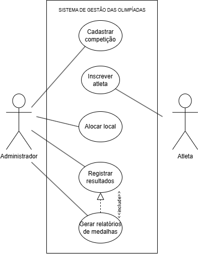
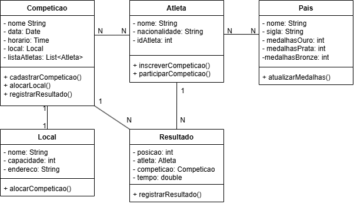
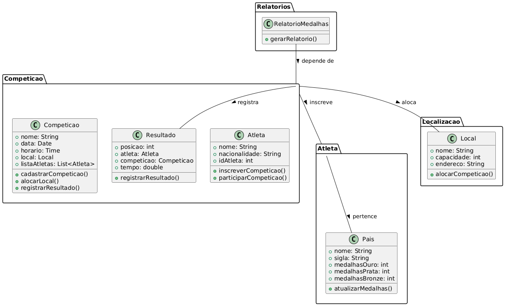
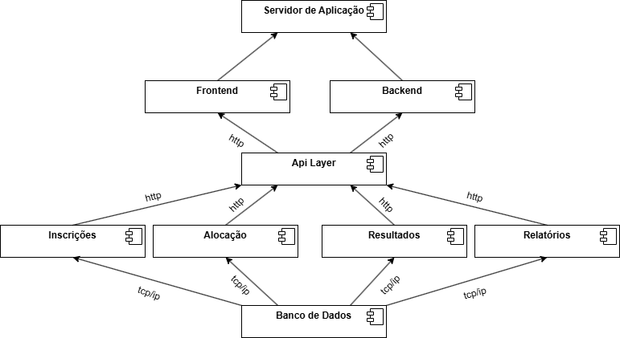
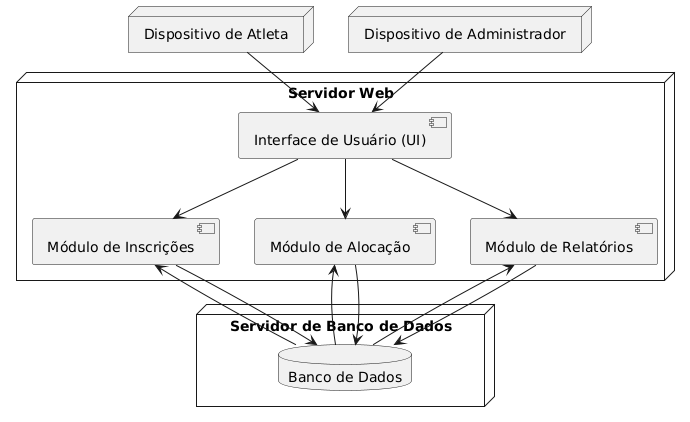

# SISTEMA DE GESTÃO DAS OLIMPÍADAS

## Alunos
João Gabriel Maia da Costa, Lucas Alves Resende

## Descrição do sistema
Com a chegada das Olimpíadas, um novo sistema de gestão é
necessário para coordenar os diferentes aspectos do evento. Este sistema deve permitir o
gerenciamento de competições, inscrições de atletas, alocação de locais para as provas,
e controle de resultados.

## Histórias de Usuário
| ID  | História de Usuário |
|----|--------------------|
| UC1  | Como administrador do sistema quero cadastrar uma nova competição para que seja possível organizar as provas com nome, modalidade, data, horário, local e lista de atletas inscritos. |
| UC2  | Como atleta quero me inscrever em competições específicas para que eu possa participar do evento representando meu país. |
| UC3  | Como administrador do sistema quero alocar locais para as competições para que não haja conflitos de horário e cada competição tenha um local adequado. |
| UC4  | Como administrador do sistema quero registrar os resultados das competições para que o sistema determine os vencedores e os classificados em segundo e terceiro lugares. |
| UC5  | Como administrador do sistema quero gerar relatórios de medalhas para que seja possível acompanhar o desempenho de cada país com base nas medalhas conquistadas. |

## Diagrama de Caso de Uso

## Diagrama de Classes

## Diagrama de Pacotes

## Diagrama de Componentes

## Diagrama de Implantação

## Ferramentas
Para o diagrama de caso de uso e diagrama de classes, foi utilizado o [draw.io](https://www.diagrams.net/).  
E para o diagrama de pacotes, componentes e implantação, foi utilizado o [PlantUML](https://plantuml.com/).